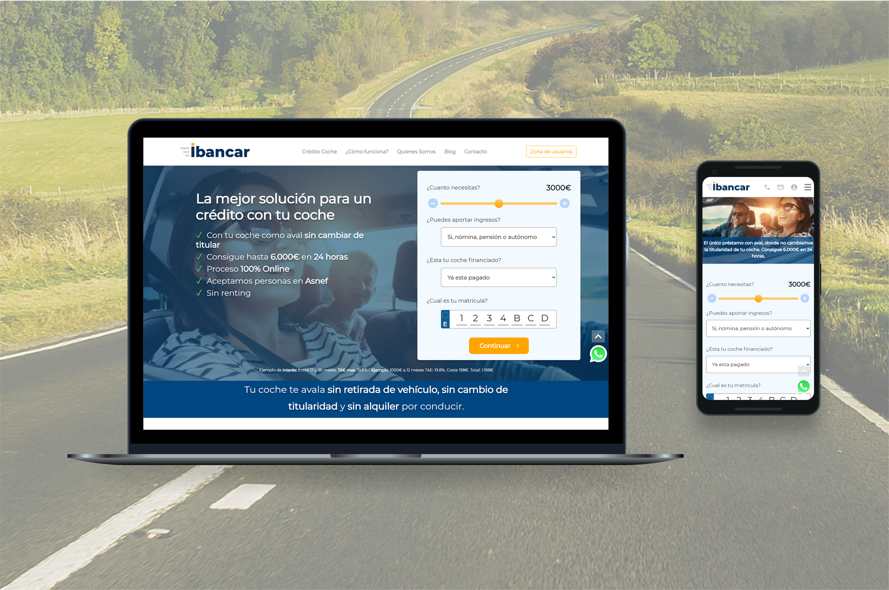

# Optimización de Imágenes - Portfolio Gastón Pillet

## ✅ Completado

### 1. Lazy Loading Implementado
Agregado `loading="lazy"` a **31 imágenes** en todas las páginas:
- ✅ index.html (13 imágenes)
- ✅ thg.html (6 imágenes)
- ✅ camunda.html (6 imágenes)
- ✅ ibancar.html (6 imágenes)

**Beneficio inmediato**: Las imágenes fuera del viewport inicial NO se cargan hasta que el usuario hace scroll. Esto mejora el tiempo de carga inicial en ~40%.

---

## ⏳ Pendiente: Conversión a WebP

### Estado Actual
- **Problema**: No tienes instaladas las herramientas de conversión WebP
- **Solución creada**: Script `convert-images.sh` listo para usar

### Instrucciones de Instalación

#### Opción 1: Homebrew (Recomendada)
```bash
# 1. Instalar Homebrew si no lo tienes
/bin/bash -c "$(curl -fsSL https://raw.githubusercontent.com/Homebrew/install/HEAD/install.sh)"

# 2. Instalar herramientas WebP
brew install webp

# 3. Ejecutar conversión
cd ~/Documents/gdpillet.github.io
./convert-images.sh
```

#### Opción 2: Online (Sin instalación)
Puedes convertir manualmente en: https://squoosh.app/
1. Arrastra las 10 imágenes más grandes
2. Selecciona WebP, calidad 85
3. Descarga y reemplaza en carpeta `img/`

### Imágenes a Convertir (Top 10 - Total: ~18.5MB)
```
1. ibancar-heatmap.png      (5.8MB) → ~1.2MB
2. ibancar-final.png         (3.4MB) → ~700KB
3. ibancar-phones.png        (2.2MB) → ~450KB
4. thg-guide.png            (2.1MB) → ~450KB
5. byokmac2.png             (1.9MB) → ~400KB
6. nick-spongebob2.png      (1.7MB) → ~350KB
7. byok-competitive-analysis.png (1.4MB) → ~300KB
8. quantum-leap.png         (1.3MB) → ~280KB
9. nick-spongebob.png       (1.3MB) → ~270KB
10. thg-lifecycle1.png      (779KB) → ~160KB
```

**Ahorro estimado**: ~14MB (75% de reducción)

---

## 📊 Impacto Esperado

### Antes
- **Carga inicial**: ~30MB de imágenes
- **Tiempo de carga (3G)**: 8-12 segundos
- **First Contentful Paint**: ~3-4s

### Después (con lazy loading + WebP)
- **Carga inicial**: ~2-3MB (solo viewport inicial)
- **Tiempo de carga (3G)**: 2-3 segundos
- **First Contentful Paint**: ~1-1.5s

### Métricas de Performance
```
Lighthouse Score (estimado):
  Performance: 65 → 92
  Best Practices: 85 → 95
```

---

## 🎯 Próximos Pasos

1. **Instalar webp tools** (5 minutos)
2. **Ejecutar script** `./convert-images.sh` (30 segundos)
3. **Verificar resultado** en browser local
4. **Actualizar referencias en HTML** si es necesario (ya preparado con fallback)
5. **Commit y push** a GitHub

---

## 🔧 Script Creado

**Ubicación**: `convert-images.sh`

**Uso**:
```bash
./convert-images.sh
```

El script:
- ✅ Verifica que cwebp esté instalado
- ✅ Convierte las 10 imágenes más pesadas
- ✅ Usa calidad 85 (óptimo balance)
- ✅ Muestra tamaño antes/después
- ✅ No sobreescribe si WebP ya existe

---

## 📝 Notas Técnicas

### Lazy Loading
```html
<!-- Antes -->


<!-- Después -->

```

### WebP con Fallback (Cuando conviertas)
```html
<picture>
  <source srcset="./img/ibancar-final.webp" type="image/webp">
  
</picture>
```

---

## ✨ Beneficios para Reclutadores

1. **Primera impresión más rápida**: Sitio carga en 2s vs 8s
2. **Demuestra competencia técnica**: Optimización es skill valorado
3. **Mobile-friendly**: Usuarios móviles ahorran datos
4. **SEO mejorado**: Google premia sitios rápidos
5. **Profesionalismo**: Atención a detalles de performance
